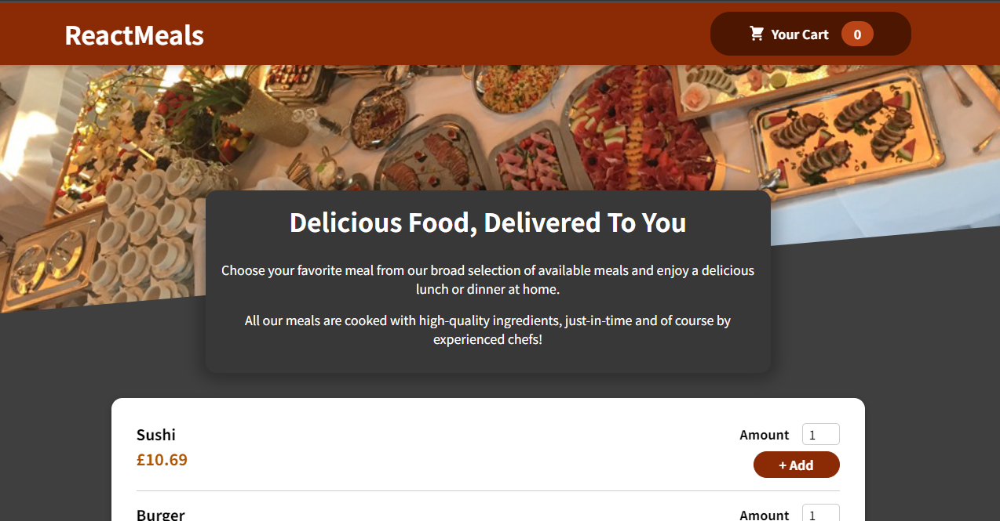

# ReactMeals

A food order app, where user is presented with a list of meals that can be choosen, add the meals to the checkout, see meals in checkout and update. User can also order meals, which is when a form will be displayed to user fill out some personal details then order, then sent to database

You can view the site here: https://gilson96.github.io/ReactMeals/

## Technologies
- HTML, 
- CSS,
- JavaScript,
- React,
- Firebase,
- Git/ GitHub,
- GitHub Pages,

## Screenshot
